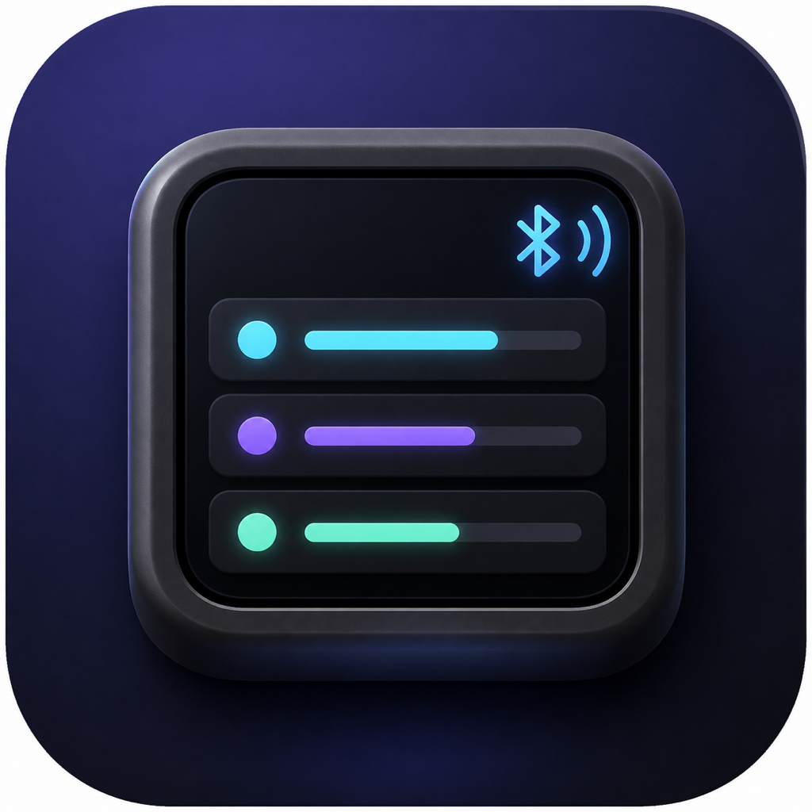
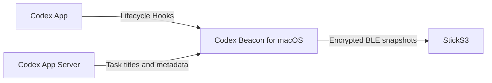

<p align="center">
  
</p>

# Codex Beacon

[](https://github.com/Rladmsrl/codex-beacon/actions/workflows/build-release.yml)
[](LICENSE)

**把 Codex 的工作状态变成桌面上的一束信号。** Codex Beacon 通过低功耗蓝牙，把 macOS Codex App 中正在思考、编辑、运行、测试或等待确认的任务，实时显示在 M5Stack StickS3 小屏上。

仓库同时包含：

- 原生 Rust macOS 菜单栏 App，打包为 Apple Silicon + Intel Universal 2；
- StickS3 固件，支持安全配对、多任务卡片和多台 Mac；
- GitHub Actions 自动构建 App、固件及带二进制附件的 Release。

## 功能

- 同时显示最多四个 Codex 任务，更多任务以数量提示；
- 区分 `THINK`、`EDIT`、`RUN`、`TEST`、`WAIT`、`DONE` 和 `ERROR`；
- WAIT/ERROR 状态显示注意标记；
- 一台 Mac 可连接多台 StickS3，一台 StickS3 最多保存八台 Mac；
- BLE Passkey、加密连接和 bonding；
- 菜单栏查看服务状态、配对、忘记设备、重启、清理和卸载；
- 设备状态栏显示实时电量，充电时显示“充电中”；
- 设备端离屏双缓冲，任务刷新不会先清黑屏，READY 状态不再周期闪烁；
- 本机只使用 Unix Domain Socket，不开放 TCP 或局域网端口；
- 服务退出时清理 socket、锁和临时文件，也提供显式清理命令。

## 工作方式



Codex Hooks 提供实时状态；Codex App Server 补充任务标题和工作目录。Mac App 将二者合并成紧凑快照，通过加密 BLE characteristic 推送给已经配对的显示器。

## 要求

- M5Stack StickS3（K150）；
- macOS 13 或更高版本，Apple Silicon 或 Intel；
- 默认位置安装的 `/Applications/ChatGPT.app` 或 `/Applications/Codex.app`；
- 首次刷机需要 USB-C 数据线。

## 快速开始

### 1. 刷入 StickS3 固件

从 [Releases](https://github.com/Rladmsrl/codex-beacon/releases) 下载 `Codex-Beacon-StickS3.factory.bin`。安装 `esptool` 后连接 StickS3：

```bash
python3 -m pip install --user esptool
python3 -m esptool --chip esp32s3 \
  --port /dev/cu.usbmodemXXXX \
  write-flash 0x0 Codex-Beacon-StickS3.factory.bin
```

如果普通连接无法刷入，按住设备侧面的复位键，看到内部绿色 LED 闪烁后松开，再执行命令。

也可以从源码刷入：

```bash
python3 -m pip install --user platformio
cd firmware
pio run -e codex-beacon -t upload
```

### 2. 安装 Mac App

从 [Releases](https://github.com/Rladmsrl/codex-beacon/releases) 下载 `Codex-Beacon-macOS.zip`，解压后把 `Codex Beacon.app` 拖入 `/Applications` 并打开。

发布包使用 ad-hoc 签名，没有 Apple Developer ID 公证。如果 Gatekeeper 阻止首次启动，请在 Finder 中右键 App，选择“打开”。系统询问蓝牙权限时请选择允许。

### 3. 配对

首次启动固件会自动开放 90 秒配对窗口，并在屏幕显示六位 Passkey。Mac 菜单栏出现 `CX` 后：

1. 选择“配对新设备”；
2. 在 macOS 蓝牙提示中输入屏幕上的六位数字；
3. 设备显示 `READY` 和 `BLE 1` 即表示加密连接成功。

### 4. 信任 Codex Hooks

在 Codex 中输入 `/hooks`，检查命令指向：

```text
/Applications/Codex Beacon.app/Contents/MacOS/codex-ble-bridge hook
```

然后信任这些 Hooks。Codex 按 Hook 定义的哈希记录信任；升级后如果定义发生变化，需要再次审查。新建一个 Codex 任务即可在设备上看到状态。

## 设备操作

| 操作 | 功能 |
| --- | --- |
| 单击 A（正面蓝色按键） | 在多任务卡片之间切换 |
| 单击 B（侧边小按键） | 唤醒屏幕并恢复亮度 |
| 长按 B | 开放 90 秒配对窗口，保留已有 Mac |
| 同时长按 A+B 6 秒 | 清空全部 BLE bonding 并重新配对 |

## 菜单栏与命令行

菜单栏包含配对、设备列表、忘记设备、启动/停止/重启服务、重装 Hooks、打开日志、清理和卸载。

App 内二进制位于：

```text
/Applications/Codex Beacon.app/Contents/MacOS/codex-ble-bridge
```

常用命令：

```bash
codex-ble-bridge doctor
codex-ble-bridge pair
codex-ble-bridge devices
codex-ble-bridge forget DEVICE_ID
codex-ble-bridge forget --all
codex-ble-bridge clean
codex-ble-bridge uninstall
codex-ble-bridge uninstall --all-data
```

持久数据保存在 `~/Library/Application Support/Codex Beacon/`。普通清理保留配对记录和日志；只有 `--all-data` 会删除它们。

## 隐私与安全

发往屏幕的内容仅包括：任务 ID 的 32 位散列、标题、状态、注意标记和运行时间。不会发送提示词、工具参数、文件内容、最终回答或凭据。

BLE characteristic 要求加密写入；未配对设备在配对窗口关闭后会被拒绝。全局 Hooks 是可执行配置，安装后应在 Codex `/hooks` 页面核对路径再信任。

## 从源码构建

### macOS Universal 2

```bash
rustup target add aarch64-apple-darwin x86_64-apple-darwin
cd macos
cargo test --locked
./scripts/package_macos.sh
```

产物位于 `macos/dist/Codex-Beacon-macOS.zip`。

### StickS3 factory image

```bash
python3 -m pip install --user platformio
cd firmware
./scripts/package_firmware.sh
```

产物位于 `firmware/dist/Codex-Beacon-StickS3.factory.bin`。

## CI/CD

每次 push 和 pull request 都会：

- 在 macOS runner 上运行 Rust 测试并生成 Universal 2 App；
- 在 Ubuntu runner 上用 PlatformIO 编译固件并生成可从地址 `0x0` 刷入的 factory image；
- 把两份产物保存为 GitHub Actions artifacts。

推送 `v*` 标签时，还会自动创建 GitHub Release 并附加 App 与固件。

## 故障排查

- **设备一直显示 READY：** 打开 `/hooks`，确认 Hook 没有加载警告且已经信任；修改后的 Hook 会要求重新信任。
- **找不到设备：** 长按 B，确认屏幕显示 PAIR 倒计时；检查 macOS 蓝牙权限。
- **配对记录异常：** Mac 端忘记设备，同时在系统蓝牙设置中忽略设备，再长按 A+B 6 秒重置 StickS3。
- **菜单栏没有 CX：** 从 `/Applications` 重新打开 App，或运行二进制的 `doctor` 子命令。
- **日志位置：** `~/Library/Application Support/Codex Beacon/bridge.log`。

## 许可与声明

[MIT License](LICENSE)。Codex 是 OpenAI 的产品名称，StickS3 是 M5Stack 的产品。本项目是独立的开源工具，不隶属于或由 OpenAI、M5Stack 背书。
